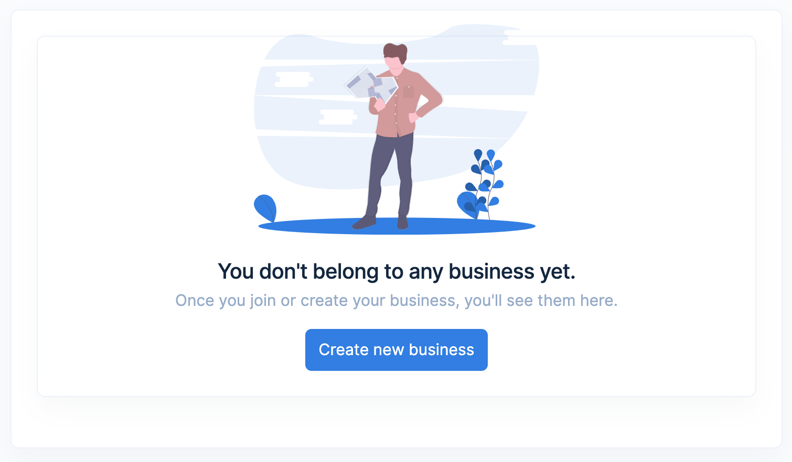

## Introduction

**Seyls** is a web based billing and invoicing application for small businesses and individuals. You can follow this guide to setup your account and get stared quickly.
All the features and how-to's will be available in this documentation.

## Create your account
Go [here](https://seyls.com/register) and create your account. If you've already signed up for a seyls account you can proceed to create your business.

## Set up business
#### What do we call a **Business** Seyls?
A business connects all your **oultets** together. It is the main name of your operation. Say, Sample LLC has 2 outlets, Sample Mart & Sample Mall.
The outlets under the same business can share its inventory and customers, transfer stock between the outlets.

Once you've signed up and log in for the first time, you'll be taken to this page.

Click on **Create new business**.

Enter a name for your business, click **Next**.

Provide the outlet name , address and other information and click **Create Outlet**.
This creates an outlet for this new Business.

Note: *If you want to add multiple outlets , this can be done later.
You'll see a **create outlet** button next to the Business name when you login.*
